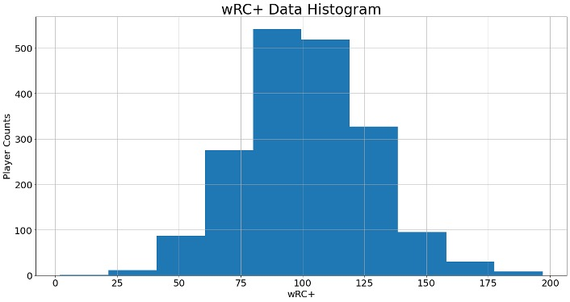
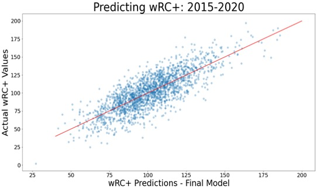

# Building Better Hitters :baseball:
## Predicting Baseball Player Offensive Success
## By: Patrick Bovard 
### *Metis Data Science Bootcamp Winter 2021 Project 2* 

### Project Introduction:
**Project Description:**    
As a lifelong baseball fan, I decided to use my regression project at Metis to help address a baseball problem.  I wanted this to be an actionable project, one that could help predict on-field results, perhaps providing infomration on where a team could find a "hidden" advantage with a given player, or "unlock" additional offensive success.  

With that in mind, I decided to utilize Statcast data as my key features, in order to predict offensive success via statistical output.  In other words, using a focus on the hitting process, could physical characteristics of how a player hits the ball, or tends to swing, predict offensive success?

The goal of this project is to use MLB Statcast data to predict MLB player offensive value, via the statistic weighted runs created plus (wRC+).  This will be done by building a linear regression model, using Statcast data as features and wRC+ as the target.  

**Features and Target Variables:**   
- Final Features: The key for this project was to utilize features that were more physical characteristics of how they were hitting the ball, to predict the actual results.  For example, how hard were they hitting the ball off the bat?  Do they make more strong or weak contact?  Do they tend to swing at many bad pitches, or swing and miss a lot?  With this in mind, my final features fell into four main buckets: 
    - General Player Data: Player Age, Sprint Speed    
    - Quality of Contact - How well do they hit the ball, and with what type of contact?:  Average Exit Velocity (Avg EV (MPH)), Average Launch Angle (Avg LA (°)), Barrel %, Solid Contact %, Flare/Burner %, Under %, Topped %, Poor/Weak %  
    - Plate Discipline - Are they an aggressive or passive hitter, do they swing at good or bad pitches?: Walk Rate (BB%), Zone Swing %, Out of Zone Swing 5, In Zone Contact %, Whiff %, First Strike %  
    - Batted Ball Direction - Where is the ball going on the field once it's hit?: Pull %, Straight Away %, Opposite Field (Oppo) %
    
    - Interaction Terms: In order to improve prediction strength, some strong interaction terms were added to the model after testing with polynomial features.  In order to preserve interpretability, only stronger interaction terms were included in the final model
        - BB%*OutOfZone%, Barrel%*Topped%, Avg EV (MPH)*Sprint Speed, Barrel%*In Zone Contact %, Under %*Topped %, In Zone Contact % * Whiff %, Whiff %**2  

- Target Variable: Weighted Runs Created Plus (wRC+)
    - For my target variable, I wanted a statistic that would be an unbiased a metric as possible to fully measure offensive success.  I settled on [weighted runs created plus (wRC+)](https://www.mlb.com/glossary/advanced-stats/weighted-runs-created-plus) for a few main reasons: 
        - It neutralizes park and league factors, to objectively compare different hitters.  In other words, it contextualizes where players are hitting - hitters who hit at easier ballparks to hit at get "points taken away" (so to speak), and players who hit at harder ballparks to hit at get "bonus points".
        - It is easy to interpret, since 100 is league average, and each point is a percent from league avearge (i.e. a wRC+ of 150 would be 50% above league average).  In this way, it is (relatively) normally distributed.  

   

**Data Used:** Data for this project was utilized primarily from FanGraphs, for player wRC+ values, and BaseballSavant, for the features from each player.  This incorporated player statistics from the 2015-2020 seasons, for players who had at least 200 plate appearances in a given season.  Each "row" of data was one player's season statistics (i.e. Mike Trout's stats from 2015 and 2016 would be separate rows).
- wRC+ Data from [Fangraphs](https://www.fangraphs.com/).   
- Statcast Data (Features) from [Baseball Savant](https://baseballsavant.mlb.com/).   
- Player Statistical Data from [Baseball Reference](https://www.baseball-reference.com/).^  

**Tools Used:**   
- Web-Scraping: Selenium, BeautifulSoup  
- Data Analysis and Model Building: Python, Pandas, Numpy, Scikit-learn  
- Visualization: Matplotlib, Seaborn  

**Possible Impacts:**   
Possible impacts of this project are on the player development and scouting side of baseball.  There are two major sides that I see being impacts:
  - Identifying players with traits that correlate with offensive success (i.e. scouting, trading, or signing those players as free agents).
  - Identifying areas of improvements that could lead to greater offensive impact on underperforming players on the current roster (i.e. player development).  

### High Level Project Results
In order to see the effect of various rounds of feature engineering, linear regression without regularization and with Lasso, Ridge, and ElasticNet regularization were attempted.  To ensure the model was not drastically overfitting, K-Fold cross validation with 5 folds was utilized for training and validating the model.  

With the final features, Linear regression with Ridge regularization was selected as the final model, as it slightly outperformed the other methods.  Additionally, Ridge regularization ensured that all features were still being utilized by the model, as compared to Lasso, so I ultimately deemed Ridge to be the best choice.

|Model Type                                          |Cross-Validation R^2 Score|
|----------------------------------------------------|--------------------------|
|Linear Regression - Standard                        |0.626                     |
|Linear Regression - LassoCV                         |0.6402                    |
|Linear Regression - RidgeCV^                        |0.6412                    |
|Linear Regression - ElasticNetCV                    |0.6406                    |

*^selected as final model*    

After training and validating the model, it was tested using a holdout set of 20% of the total data (~1800 data points in total).  The scoring on the final model was scoring was a **R^2 score of 0.653** with a **mean average error (M.A.E) of 12.56 wRC+ points**. 

   

For a deeper walkthrough of my results, additional details are available in the **Presentation** folder of this repo, with PDF and Powerpoint versions of my final presentation available.

### NAVIGATING THE REPOSITORY:
**General Workflow of the Repo**:  Below is a general guide for navigating the files of this repo, in rough chronological order of the overall project workflow.

  **1. Webscraping_code Folder:** This folder contains code on scraping the data from the various sites utilized for statistics, and organized it into a Pandas dataframe.  
  - Fangraphs_code_notebook.ipynb: contains code on scraping data for wRC+ from FanGraphs  
  - Savant_code_notebook.ipynb: contains code on scraping features data from BaseballSavant
  - Baseball Reference Code.ipynb: contains code on scraping data from Baseball Reference.  Note, as FanGraphs wRC+ was easier to integrate in Pandas with the BaseballSavant data, Baseball Reference data was ultimately not used in my modeling.  
  - baseball_savant_code.py: contains code on functions created to assist in scraping from BaseballSavant
  - fangraphs_wrc_code.py: contains code on functions created to assist in scraping from FanGraphs
  - savant_fangraphs_merge.ipynb: contains code on merging the BaseballSavant and FanGraphs data into a single Pandas dataframe to utilize for modeling. Output of this file is *stats.pkl*, in the Data folder.  
  
  **2. Early_Models folder:** This folder contains code on the early iterations of my model, with initial features and continuous improvements/added features.
  - Project_2_starter_nb.ipynb: contains basic work on the model, utilizing only 1-2 features. 
  - first_model_notebook.ipynb: contains the first round of models with the original set of features.
  - second_model_notebook.ipynb: contains work with new rounds of model testing/new features, mainly with position removed, various other combinations of features.  

  **3. Final_Models folder:** This folder contains later iterations of the model, with the final model work in Final_Model_notebook.ipynb.
  - new_savant_stats.ipynb: added in additioanl quality of contact stats, in zone contact rate, and first strike rate.  Led to creation of stats_2.pkl, new_stats.pkl in the Data file with these new stats brought in. 
  - new_stats_modeling.ipynb:  used new stats, modeling and residual analysis in this code led to me making the following updates when proceeding to the final model:  
            - Removed: Hard Hit%, GB%, FB%, LD%  
            - Added: Walk Rate, Whiff Rate   
  - **Final Modeling and Testing: Final_Model_notebook**: contains code on the final model training/validating, final model selection, model testing on the holdout set, and some further work on residual analysis.  This file uses the function lr_validation_train.py, which has functions to run various types of Linear Regression: Simple, Simple with KFOLD Cross Validation, LassoCV, RidgeCV, ElasticNetCV.  Additionally, the function lasso_polynomial.py was used to run LASSO Regression with Polynomial terms, to identify strong interaction terms to use in the final model. 
